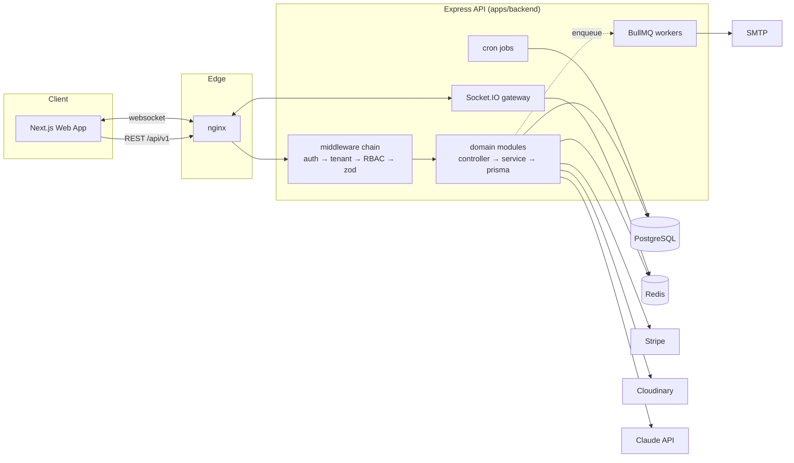
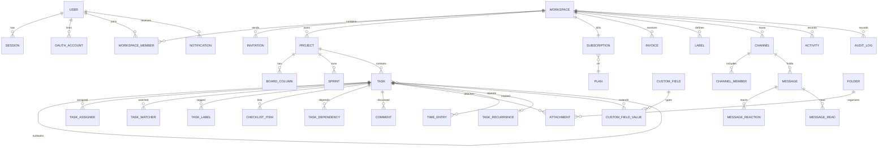

# TaskForge

**Enterprise project management platform** — boards, sprints, time tracking, chat, files, reports, billing, and AI-assisted planning in one multi-tenant workspace.

Built with Next.js, Express, PostgreSQL, Redis, Socket.IO, Prisma, Stripe, Cloudinary, and Claude.

**🔗 Live demo:** [taskforge-saas.vercel.app](https://taskforge-saas.vercel.app) — full stack, real sign-up works

<p>
  <a href="https://taskforge-saas.vercel.app"></a>
  
  
  
</p>

> **Try it:** create an account, or sign in with the demo login
> **`demo@taskforge.local`** / **`Demo1234!`** to explore a seeded workspace.
> Stack: Next.js on Vercel · Express API + Socket.IO on Render · PostgreSQL on
> Neon · Redis on Render. The API is on a free tier, so the very first request
> after idle may take ~50s to wake — subsequent requests are instant.

---

## Feature highlights

| Area | What you get |
| --- | --- |
| **Multi-tenancy** | Isolated workspaces, 7-role RBAC (Owner → Guest), invitations, ownership transfer |
| **Auth** | JWT access + rotated refresh tokens w/ theft detection, Google & GitHub OAuth, multi-device sessions, suspicious-login alerts |
| **Projects** | Templates, duplication, favorites, budgets, client info, derived health, archive |
| **Tasks** | Kanban drag-drop (lexorank), subtasks, checklists, labels, dependencies w/ cycle detection, custom fields, recurrence, watchers, history |
| **Agile** | Sprints (single-active), burndown, velocity, workload reports |
| **Time** | Start/pause/resume/stop timers, manual entries, billable rates + amounts |
| **Realtime** | Live board updates, presence, typing indicators, notification push via Socket.IO |
| **Chat** | Workspace/project/task/group/direct channels, reactions, read receipts |
| **Files** | Cloudinary uploads, folders, version chains, storage quotas |
| **Billing** | Stripe checkout + portal, 4 plan tiers, webhooks, coupons, invoices, plan limits |
| **AI** | Task generation, sprint planning, meeting summaries, risk analysis, priority + deadline prediction (Claude) |
| **Admin** | Platform analytics, user/workspace management, plans, coupons, audit logs, feature flags |

## Monorepo layout

```
taskforge/
├── apps/
│   ├── backend/          Express + Prisma REST/Socket.IO API
│   │   ├── prisma/       schema.prisma, migrations, seed
│   │   ├── src/
│   │   │   ├── config/       zod-validated env, swagger
│   │   │   ├── lib/          prisma, redis, mailer, cloudinary, stripe, anthropic, logger
│   │   │   ├── middlewares/  auth, tenant scope, RBAC, validation, rate limits, errors
│   │   │   ├── modules/      auth, workspaces, projects, tasks, sprints, time,
│   │   │   │                 reports, chat, notifications, files, search, billing, ai, admin
│   │   │   ├── services/     audit, activity, notifications, plan limits, realtime
│   │   │   ├── sockets/      gateway (rooms, presence, typing, cursors)
│   │   │   ├── queues/       BullMQ email worker
│   │   │   └── jobs/         cron: reminders, recurring tasks, health, credits
│   │   └── tests/        unit + supertest integration suites
│   └── frontend/         Next.js 14 App Router
│       └── src/
│           ├── app/          (marketing) (auth) (app)/w/[workspaceId]/…
│           ├── components/   ui primitives, shell, board, tasks, calendar, gantt, sprints
│           ├── hooks/        TanStack Query hooks per domain
│           ├── lib/          axios + silent refresh, socket, env
│           └── stores/       zustand (auth, ui)
├── packages/
│   ├── shared-types/     enums, RBAC matrix, API envelope, socket contract
│   ├── shared-utils/     lexorank, dates, formatting (tested)
│   └── shared-ui/        design tokens, tailwind preset, cn
├── nginx/                production reverse proxy
├── docker-compose.yml    dev infra (postgres + redis)
├── docker-compose.prod.yml
└── .github/workflows/ci.yml
```

## Architecture



**Request path:** every workspace-scoped route runs `authenticate` (JWT + revocation check) → `tenantScope` (membership lookup, Redis-cached) → `authorize(permission)` (role matrix from `shared-types`) → `validate` (Zod, sanitized replace) → controller. Repositories additionally filter by `workspaceId` for defense in depth.

**Realtime:** the Socket.IO gateway authenticates the handshake with the same JWT, verifies membership before every room join, keeps presence in Redis, and domain services broadcast through a thin facade — REST mutations emit live events without importing socket internals.

## ER diagram (core)



Full schema: [apps/backend/prisma/schema.prisma](apps/backend/prisma/schema.prisma) (40+ models — UUIDs, `createdAt/updatedAt/deletedAt` soft deletes, tenant `workspaceId` on every owned row).

## Quick start (development)

```bash
# 1. Prereqs: Node 20+, Docker
cp .env.example .env            # defaults work for local dev

# 2. Infrastructure
docker compose up -d            # Postgres :5432, Redis :6379
#    (if a local Postgres owns 5432, set POSTGRES_PORT=5433 in .env
#     and update DATABASE_URL accordingly)

# 3. Install + database
npm install
npm run prisma:migrate          # applies migrations
SEED_DEMO=true npm run prisma:seed   # plans + demo workspace

# 4. Run both apps
npm run dev                     # web http://localhost:3000, api :5000
```

**Demo login:** `demo@taskforge.local` / `Demo1234!`
**Super admin:** `admin@taskforge.local` / `ChangeMe123!`
**API docs:** http://localhost:5000/api/docs (Swagger, non-production only)

Optional integrations activate when keys are present in `.env`: Stripe (billing), Cloudinary (files), SMTP (email), Anthropic (AI), Google/GitHub (OAuth). Everything else works without them — those endpoints return `503` gracefully.

## API

REST, versioned at `/api/v1`, JSON envelope:

```jsonc
{ "success": true, "data": { }, "meta": { "page": 1, "total": 42 } }
{ "success": false, "error": { "code": "VALIDATION_ERROR", "message": "…", "details": [] } }
```

72 documented endpoints across 15 tags — interactive reference at `/api/docs`, machine-readable spec at `/api/docs.json`. Import that URL directly into Postman/Insomnia as the API collection.

## Testing

```bash
npm test --workspace=@taskforge/backend      # RBAC + recurrence unit tests,
                                             # auth-flow + tenant-isolation integration (supertest)
npm test --workspace=@taskforge/shared-utils # lexorank property tests
```

Integration tests run against an isolated `tests` schema (provisioned automatically by jest globalSetup) — developer data is never touched.

## Production deployment

```bash
cp .env.example .env    # set REAL secrets: JWT_*, COOKIE_SECRET, DB password,
                        # Stripe/Cloudinary/SMTP/Anthropic keys, APP_URL, CORS_ORIGINS
docker compose -f docker-compose.prod.yml up -d --build
```

nginx listens on :80 → terminate TLS at your load balancer or add certificates to [nginx/nginx.conf](nginx/nginx.conf). Migrations run automatically when the API container boots. See [docs/DEPLOYMENT.md](docs/DEPLOYMENT.md) for the full guide and [docs/PRODUCTION-CHECKLIST.md](docs/PRODUCTION-CHECKLIST.md) before going live.

## Security posture

- Helmet, CORS allowlist, Redis-backed rate limits (strict on credential endpoints)
- bcrypt(12) passwords; refresh tokens stored hashed, rotated, reuse-revoked
- httpOnly/SameSite cookies scoped to the auth path; access tokens live in memory only
- Zod validation on every input; Prisma parameterized queries (no SQL injection surface)
- Full audit trail (auth events, role changes, admin actions) + suspicious-login emails
- Plan limits, storage quotas, AI credit metering enforced server-side

## License

Proprietary — all rights reserved.
